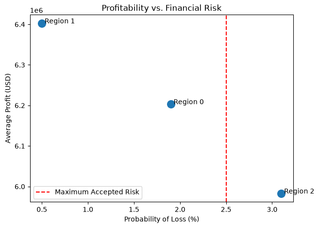

# Oil Well Location Optimization for OilyGiant

<p align="center">
  
</p>

## 1. The Problem

OilyGiant plans to develop **200 new oil wells** across three exploration regions. Since drilling requires a fixed investment budget 
of **$100 million USD**, selecting the wrong region could result in substantial financial losses. Beyond maximizing expected profits, 
the company requires that the probability of financial loss remains below **2.5%**.

---

## 2. Objective

The objective of this project is to identify the exploration region that offers the best balance between **profitability** and **financial risk** 
by combining machine learning predictions with bootstrap-based risk simulation.

---

## 3. Methodology

### Data & Target

* **Source:** Geological exploration data from three independent oil-producing regions.
* **Volume:** Approximately **100,000 exploration sites per region**.
* **Features:** Three anonymized geological characteristics (`f0`, `f1`, `f2`).
* **Target:** Estimated oil reserve volume (`product`).

### Data Exploration & Cleaning

The datasets were inspected for missing values, duplicate identifiers, and distributional differences across regions. 
Duplicate well IDs were removed while preserving the first occurrence, ensuring each observation represented a unique exploration site.

### Predictive Modeling

A separate **Linear Regression** model was trained for each region using a **75/25 train-validation split** with a fixed `random_state` to ensure reproducibility.

Model performance was evaluated using **Root Mean Squared Error (RMSE)**.

### Business Evaluation

Predicted reserve volumes were used to rank wells within each region. Following the business requirements, the **200 highest-ranked wells** 
were selected, and their corresponding actual reserve volumes were used to estimate potential profits.

### Risk Simulation

To account for uncertainty in exploration outcomes, **1,000 Bootstrap simulations** were performed for each region.

For every simulation, the analysis estimated:

* Average expected profit
* 95% confidence interval
* Probability of financial loss

---

## 4. Findings

### Model Performance

| Region   |      RMSE |
| -------- | --------: |
| Region 0 | **37.76** |
| Region 1 |  **0.89** |
| Region 2 | **40.15** |

Region 1 achieved the lowest prediction error due to its highly discrete target distribution, while Regions 0 and 2 exhibited greater geological variability.

---

### Financial Analysis

| Region   | Mean Profit (USD) | Loss Risk |
| -------- | ----------------: | --------: |
| Region 0 |           ~$6.20M |  **1.9%** |
| Region 1 |       **~$6.40M** |  **0.5%** |
| Region 2 |           ~$5.98M |  **3.1%** |

---

### Business Decision

Although **Region 0** generated the highest profit under an idealized well-selection scenario, **Bootstrap simulations demonstrated 
that Region 1 provides the best overall investment opportunity**, combining:

* the highest expected profit,
* the lowest prediction uncertainty,
* and a financial loss probability well below the company's 2.5% threshold.

---

## 5. Recommendations & Business Decision

* Prioritize **Region 1** for the deployment of the new wells.
* Incorporate additional geological and spatial variables to improve reserve estimation.
* Evaluate more advanced regression algorithms (such as Random Forest, XGBoost, or LightGBM) to capture potential non-linear geological relationships.
* Integrate external economic variables (e.g., oil price fluctuations) to perform dynamic profitability analyses.

---

## 6. Technologies

* **Language:** Python 3.9+
* **Data Manipulation:** Pandas, NumPy
* **Machine Learning:** Scikit-Learn
* **Visualization:** Matplotlib, Seaborn
* **Statistical Simulation:** Bootstrap Resampling

---

# Project Structure

```text
├── data/                  # Raw datasets
├── img/                   # Generated figures and visualizations
├── notebook/              # Jupyter Notebook containing the full analysis
├── README.md              # Project documentation
└── requirements.txt       # Project dependencies
```

---

# Installation & Environment Setup

### 1. Clone the repository

```bash
git clone https://github.com/fiorellatrigo/oil_well_location_optimization.git
cd oil_well_location_optimization
```

### 2. Create and activate a virtual environment

**Windows**

```powershell
python -m venv .venv
.\.venv\Scripts\activate
```

**Mac/Linux**

```bash
python -m venv .venv
source .venv/bin/activate
```

### 3. Install dependencies

```bash
pip install -r requirements.txt
```

---

# References & Data Sources

* **Dataset:** TripleTen — OilyGiant Oil Well Development Project (educational dataset).
